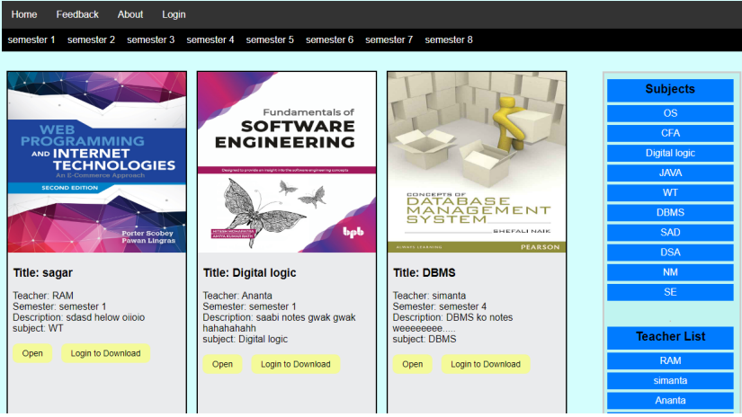

# Online Notes (For BCA)

**Online Notes** is a web-based platform that enables BCA students to access, view, and download academic resources like notes, slides, and other materials. It simplifies the process of finding study resources by categorizing them into semesters, subjects, and teachers.

---

 **Home Page**
   

      
   

   Displays available notes categorized by semester, subject, and teacher.

---

## Technologies Used
- **Frontend**: HTML, CSS, JavaScript
- **Backend**: PHP, MySQL

---

## Conclusion
This project enhances the accessibility of academic resources for BCA students by providing a centralized and user-friendly platform. Future developments may include search functionality and broader categorization options.

---

